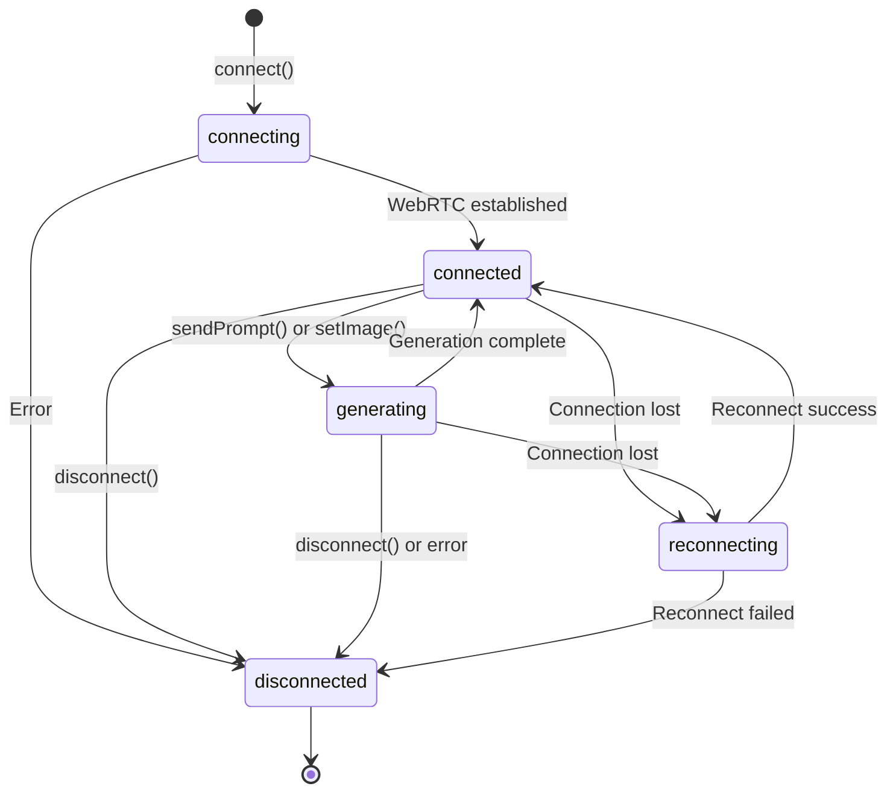

The `ConnectionState` type represents the current state of a real-time WebRTC connection.

## Type Definition

```typescript
type ConnectionState = 
  | "connecting" 
  | "connected" 
  | "generating" 
  | "disconnected" 
  | "reconnecting";
```

## States

### `connecting`

The initial state when establishing a WebRTC connection. This includes:
- Creating the WebSocket connection
- Exchanging SDP offers/answers
- Establishing ICE candidates
- Waiting for the "ready" signal from the server

**Typical duration**: 2-5 seconds

### `connected`

The connection is fully established and ready to receive prompts or process video. The video stream is active but no generation is currently in progress.

**Transitions from**: `connecting`, `generating`

### `generating`

The model is actively processing a prompt and generating content. The video stream shows the generation progress.

**Transitions from**: `connected`  
**Transitions to**: `connected` (when generation completes)

### `disconnected`

The connection has been closed, either intentionally via `disconnect()` or due to an error. No video stream is available.

**Transitions from**: Any state  
**Final state**: Cannot transition to other states without calling `connect()` again

### `reconnecting`

The connection was lost unexpectedly and the SDK is attempting to reconnect automatically. The previous session state may be restored if reconnection succeeds.

**Transitions from**: `connected`, `generating`  
**Transitions to**: `connected`, `disconnected`

## Usage Examples

### Listening to State Changes

```typescript
import { createDecartClient, models } from '@decartai/sdk';

const client = createDecartClient({ apiKey: 'your-api-key' });

client.realtime.on('connectionStateChange', (state) => {
  console.log('Connection state:', state);
  
  switch (state) {
    case 'connecting':
      console.log('Establishing connection...');
      break;
    case 'connected':
      console.log('Ready to send prompts');
      break;
    case 'generating':
      console.log('Generation in progress...');
      break;
    case 'disconnected':
      console.log('Connection closed');
      break;
    case 'reconnecting':
      console.log('Attempting to reconnect...');
      break;
  }
});

await client.realtime.connect({
  model: models.realtime('mirage')
});
```

### Building a Status UI

```typescript
function getStatusColor(state: ConnectionState): string {
  switch (state) {
    case 'connecting':
    case 'reconnecting':
      return 'yellow';
    case 'connected':
      return 'green';
    case 'generating':
      return 'blue';
    case 'disconnected':
      return 'red';
  }
}

function getStatusMessage(state: ConnectionState): string {
  switch (state) {
    case 'connecting':
      return 'Connecting to server...';
    case 'connected':
      return 'Connected - Ready';
    case 'generating':
      return 'Generating content...';
    case 'disconnected':
      return 'Disconnected';
    case 'reconnecting':
      return 'Reconnecting...';
  }
}

client.realtime.on('connectionStateChange', (state) => {
  updateUI({
    color: getStatusColor(state),
    message: getStatusMessage(state)
  });
});
```

### Conditional Actions Based on State

```typescript
function canSendPrompt(state: ConnectionState): boolean {
  return state === 'connected' || state === 'generating';
}

async function sendPromptIfReady(prompt: string) {
  const state = client.realtime.getState();
  
  if (!canSendPrompt(state)) {
    console.warn(`Cannot send prompt in state: ${state}`);
    return;
  }
  
  await client.realtime.sendPrompt({
    text: prompt,
    enhance: true
  });
}
```

## State Transitions



## Related APIs

- [on('connectionStateChange')](/api/realtime/events#connectionstatechange) - Listen for state changes
- [getState()](/api/realtime/connect) - Get current connection state
- [connect()](/api/realtime/connect) - Initiate connection
- [disconnect()](/api/realtime/disconnect) - Close connection

## Notes

- State changes are emitted via the `connectionStateChange` event
- The `generating` state is triggered automatically when processing begins
- Reconnection attempts are automatic and do not require manual intervention
- Always check the current state before calling state-dependent methods