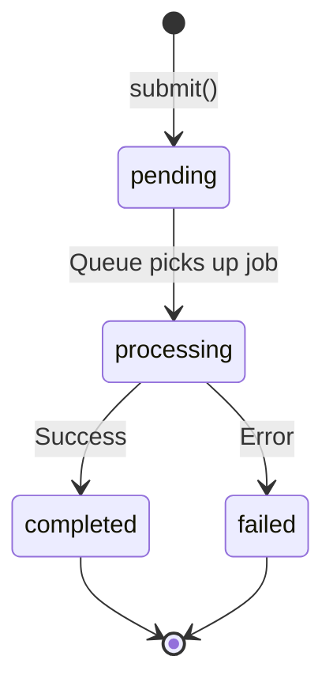

The queue API uses several types to track the status and results of asynchronous video generation jobs.

## JobStatus Type

```typescript
type JobStatus = "pending" | "processing" | "completed" | "failed";
```

### Status Values

<ParamField path="pending" type="string">
  Job has been submitted and is waiting in the queue to be processed.
</ParamField>

<ParamField path="processing" type="string">
  Job is currently being processed by the model.
</ParamField>

<ParamField path="completed" type="string">
  Job has finished successfully and the result is ready to download.
</ParamField>

<ParamField path="failed" type="string">
  Job encountered an error and could not complete.
</ParamField>

## JobSubmitResponse

Response returned when submitting a new job via `queue.submit()`.

```typescript
type JobSubmitResponse = {
  job_id: string;
  status: JobStatus;
};
```

### Fields

<ParamField path="job_id" type="string" required>
  Unique identifier for the submitted job. Use this to check status or retrieve results.
</ParamField>

<ParamField path="status" type="JobStatus" required>
  Initial status of the job, typically `"pending"`.
</ParamField>

## JobStatusResponse

Response returned when checking job status via `queue.getStatus()`.

```typescript
type JobStatusResponse = {
  job_id: string;
  status: JobStatus;
};
```

### Fields

<ParamField path="job_id" type="string" required>
  The job identifier.
</ParamField>

<ParamField path="status" type="JobStatus" required>
  Current status of the job.
</ParamField>

## QueueJobResult

Discriminated union type returned by `queue.submitAndPoll()` representing the final result.

```typescript
type QueueJobResult =
  | { status: "completed"; job_id: string; data: Blob }
  | { status: "failed"; job_id: string; error: string };
```

### Success Result

<ParamField path="status" type="'completed'" required>
  Indicates the job completed successfully.
</ParamField>

<ParamField path="job_id" type="string" required>
  The job identifier.
</ParamField>

<ParamField path="data" type="Blob" required>
  The generated video as a binary Blob.
</ParamField>

### Failure Result

<ParamField path="status" type="'failed'" required>
  Indicates the job failed.
</ParamField>

<ParamField path="job_id" type="string" required>
  The job identifier.
</ParamField>

<ParamField path="error" type="string" required>
  Error message describing why the job failed.
</ParamField>

## Usage Examples

### Submit and Get Job ID

```typescript
import { createDecartClient, models } from '@decart-ai/sdk';

const client = createDecartClient({ apiKey: 'your-api-key' });

const response = await client.queue.submit({
  model: models.video('lucy-pro-t2v'),
  prompt: 'A cat playing piano'
});

console.log('Job ID:', response.job_id);
console.log('Status:', response.status); // "pending"
```

### Poll Job Status

```typescript
const jobId = 'job_abc123';

const interval = setInterval(async () => {
  const status = await client.queue.getStatus(jobId);
  console.log('Current status:', status.status);
  
  if (status.status === 'completed') {
    clearInterval(interval);
    const blob = await client.queue.getResult(jobId);
    console.log('Video ready:', blob);
  } else if (status.status === 'failed') {
    clearInterval(interval);
    console.error('Job failed');
  }
}, 2000);
```

### Submit and Poll (Automatic)

```typescript
const result = await client.queue.submitAndPoll({
  model: models.video('lucy-pro-i2v'),
  image: imageFile,
  prompt: 'Animate this image',
  onStatusChange: (status) => {
    console.log('Status update:', status.status);
  }
});

if (result.status === 'completed') {
  console.log('Success! Job:', result.job_id);
  const videoUrl = URL.createObjectURL(result.data);
  videoElement.src = videoUrl;
} else {
  console.error('Failed:', result.error);
}
```

### Type Guards for Result Handling

```typescript
function isCompletedResult(result: QueueJobResult): 
  result is { status: 'completed'; job_id: string; data: Blob } {
  return result.status === 'completed';
}

function isFailedResult(result: QueueJobResult): 
  result is { status: 'failed'; job_id: string; error: string } {
  return result.status === 'failed';
}

const result = await client.queue.submitAndPoll({
  model: models.video('lucy-pro-t2v'),
  prompt: 'Epic mountain vista'
});

if (isCompletedResult(result)) {
  console.log('Video blob:', result.data);
} else if (isFailedResult(result)) {
  console.error('Error:', result.error);
}
```

### Status-Based UI Updates

```typescript
function getStatusIcon(status: JobStatus): string {
  switch (status) {
    case 'pending': return '⏳';
    case 'processing': return '⚙️';
    case 'completed': return '✅';
    case 'failed': return '❌';
  }
}

function getStatusMessage(status: JobStatus): string {
  switch (status) {
    case 'pending': return 'Waiting in queue...';
    case 'processing': return 'Generating video...';
    case 'completed': return 'Ready to download!';
    case 'failed': return 'Generation failed';
  }
}

await client.queue.submitAndPoll({
  model: models.video('lucy-pro-v2v'),
  video: videoFile,
  prompt: 'Cyberpunk style',
  onStatusChange: (status) => {
    updateUI({
      icon: getStatusIcon(status.status),
      message: getStatusMessage(status.status)
    });
  }
});
```

## Status Flow



## Related Methods

- [queue.submit()](/api/queue/submit) - Submit a job and get JobSubmitResponse
- [queue.getStatus()](/api/queue/status) - Get JobStatusResponse for a job
- [queue.getResult()](/api/queue/result) - Download completed job result
- [queue.submitAndPoll()](/api/queue/submit-and-poll) - Submit and wait for QueueJobResult

## Notes

- Jobs typically move from `pending` → `processing` → `completed` or `failed`
- The `submitAndPoll()` method automatically polls until `completed` or `failed`
- Use the `onStatusChange` callback to track progress during polling
- Results are only available for jobs with `completed` status
- Failed jobs include an error message explaining what went wrong